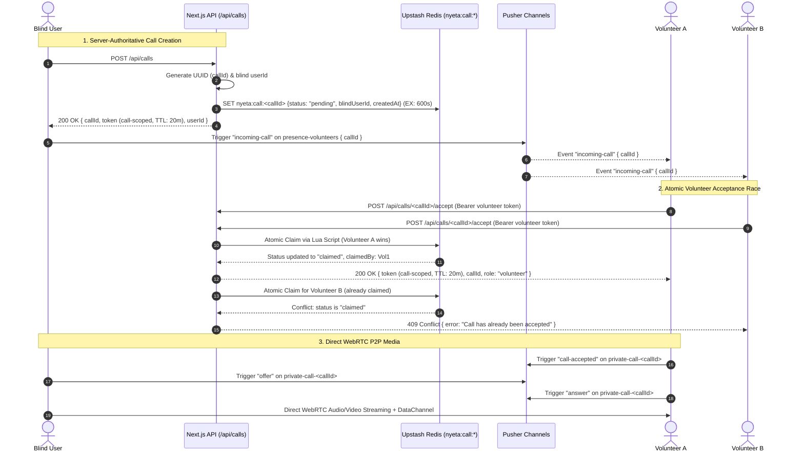

<div align="center">

# Nyeta

### Real-Time Visual Assistance for Blind and Visually Impaired Users

A graduation project combining accessible interfaces, human volunteer assistance, on-device object detection, and Google Gemini AI vision features.

[](https://nyeta.vercel.app)
[](https://nextjs.org/)
[](https://www.typescriptlang.org/)
[](https://ai.google.dev/)

</div>

---

## 📄 Overview

**Nyeta** is a web-based visual-assistance platform designed to help blind and visually impaired users understand their surroundings and request help in real time. Built with a **Serverless Vercel-First Architecture**, Nyeta combines **Gemini AI Vision** and **Low-Latency WebRTC Video/Audio Streaming** to deliver two primary capabilities:

1. **Human assistance** through live video and audio calls between a blind user and an available volunteer with remote controls (flash, snapshot captures).
2. **AI-assisted vision** through Google Gemini for scene descriptions, Thai currency recognition with running totals, and document reading.

The interface is designed for eyes-free operation with spoken feedback, voice input, vibration patterns, audio cues, large controls, and screen-reader-friendly interactions.

---

## 🏛 Feature-First Architecture

Nyeta uses a **Feature-First / Vertical Slice Architecture**. Instead of grouping the entire application only by technical file type, code is grouped by the product feature or responsibility it belongs to. This keeps feature-specific UI, logic, client utilities, and types close together while shared and server-only concerns stay separated.

### Main areas

| Area | What it is | Responsibility |
|---|---|---|
| `src/app/` | **Application entry points** | Defines Next.js routes, pages, layouts, and API endpoints. These files stay thin and mainly connect requests/screens to feature or server logic. |
| `src/features/` | **Product feature modules** | Contains the real user-facing behavior of Nyeta. Each feature owns its UI, hooks, client logic, and domain-specific types. |
| `src/shared/` | **Reusable cross-feature code** | Holds accessibility services, common hooks, UI primitives, and types that are used by more than one feature. |
| `src/server/` | **Trusted server-only layer** | Handles secrets, authentication, Redis state, Pusher server operations, AI requests, security checks, and WebRTC server configuration. |

```text
src/
├── app/                  # ROUTING LAYER: Next.js entry points; keeps route/page files thin
│   ├── blind/            # /blind page; starts and renders the blind-assistant experience
│   ├── volunteer/        # /volunteer page; starts and renders the volunteer experience
│   ├── call/             # Call-page route; connects URL/session state to the calling feature
│   └── api/              # HTTP API endpoints; validates requests then delegates to src/server/
│
├── features/             # FEATURE LAYER: complete user-facing capabilities grouped by domain
│   ├── blind-assistant/  # Everything specific to AI assistance for blind users
│   │   ├── components/   # Feature UI: camera view, controls, status panels, etc.
│   │   ├── hooks/        # Feature behavior/state: camera, scanning, speech, mode workflows
│   │   ├── client/       # Browser-side helpers: object detection, image/OCR processing, AI request clients
│   │   ├── types/        # Types used only by the blind-assistant domain
│   │   └── BlindAssistScreen.tsx # Top-level screen that composes the feature pieces together
│   │
│   └── calling/          # Everything specific to live blind-user ↔ volunteer assistance calls
│       ├── components/   # Call UI: video/image viewer, chat, capture and remote-control UI
│       ├── hooks/        # WebRTC/call behavior: blind flow, volunteer flow, data-channel handling
│       ├── client/       # Browser-side signaling, peer connection, and call-session clients
│       ├── types.ts      # Types used by the calling domain
│       ├── BlindCallScreen.tsx   # Blind user's active-call screen/orchestrator
│       └── VolunteerScreen.tsx   # Volunteer dashboard/call screen/orchestrator
│
├── shared/               # SHARED LAYER: reusable code that does not belong to only one feature
│   ├── accessibility/    # SpeechManager/TTS, haptics, audio earcons, accessibility coordination
│   ├── hooks/            # Generic reusable hooks such as Wake Lock and speech-status handling
│   ├── ui/               # Common UI infrastructure such as ErrorBoundary and shared icons
│   └── types/            # Interfaces/types reused across multiple domains
│
└── server/               # SERVER LAYER: trusted code that must never run in the browser
    ├── ai/               # Gemini client, prompts, validation, response/domain types
    ├── auth/             # Session authentication, identity validation, and token signing
    ├── calls/            # Server-authoritative call lifecycle and Upstash Redis call state
    ├── realtime/         # Pusher server triggers, presence/private-channel authentication
    ├── security/         # Rate limiting, request validation, and abuse/security guards
    ├── webrtc/           # ICE/STUN/TURN configuration delivered securely to clients
    └── types.ts          # Types used only by server-side code
```

### How the layers work together

A typical request flows in one direction:

```text
User / Browser
     ↓
src/app/          Route or API entry point
     ↓
src/features/     Feature UI + feature-specific client behavior
     ↓
src/server/       Trusted backend operations when server access is required

src/shared/       Reusable accessibility/UI utilities can be consumed by multiple features
```

For example, the `/blind` route should mainly load the **blind-assistant feature** rather than contain all camera, AI, speech, and scanning logic itself. Likewise, API routes under `src/app/api/` remain small and pass trusted operations such as Gemini requests, call-state changes, authentication, and rate limiting to `src/server/`.

---

## 🏗 Serverless Architecture & Security Model

Nyeta is engineered to deploy entirely on **Vercel** with zero standalone servers (no VPS, Express, or Railway dependencies):

- **Frontend & App Router**: Next.js 16 + React 19 + TypeScript + Tailwind CSS 4.
- **AI Vision (Server-Side Only)**: Next.js Route Handler (`/api/gemini`) manages Google Gemini AI Vision calls securely. Client applications never hold Gemini API keys and request assistance via predefined mode aliases (`assistant`, `currency`, `reader`).
- **Realtime Signaling**: Managed WebSockets via **Pusher** for presence, incoming calls, and WebRTC SDP/ICE exchange.
- **Server-Authoritative Call Lifecycle & Redis State**:
  - Temporary call state stored in **Upstash Redis** (`nyeta:call:<callId>`) with automatic 10-minute TTL.
  - Server generates cryptographically random `callId` and server-authoritative identities.
  - Atomic volunteer call claiming via Redis Lua scripts (guaranteeing that two simultaneous volunteers cannot claim the same call; second volunteer receives HTTP 409 Conflict).
- **Session Security & Token Segregation**:
  - HMAC-SHA256 authenticated session tokens generated via `/api/session` and `/api/calls`.
  - **Base session token**: 4-hour TTL for anonymous presence.
  - **Call-scoped token**: 20-minute TTL strictly bound to the specific `callId`. Generic tokens with `callId: null` are strictly blocked from private call channels.
  - Strict channel and event allowlists preventing spoofed signaling.
- **Rate Limiting**: Serverless sliding window rate limiter backed by **Upstash Redis** (with automatic in-memory fallback):
  - `gemini`: 20 req / 60s
  - `pusher_trigger`: 60 req / 60s
  - `session`: 30 req / 60s
  - `calls_accept`: 10 req / 60s
- **WebRTC ICE/TURN Fallback**: Dynamic ICE credential distribution via `/api/webrtc/ice` with private cache headers (`Cache-Control: private, no-store, no-cache`) ensuring reliable connections across restrictive mobile NATs/firewalls.

---

## 🔄 Call Lifecycle Flow



---

## 🔑 Core Features

### Human Assistance
- One-tap help requests from the blind-user interface (`/blind`)
- Volunteer availability and incoming-call handling (`/volunteer`)
- Rear-camera video and microphone streaming via native WebRTC
- Remote flashlight and call controls through WebRTC data channels
- Real-time signaling and presence events through Pusher Channels

### Gemini Visual Assistance
- Scene descriptions and visual questions in Thai (`assistant` mode)
- Thai banknote (20, 50, 100, 500, 1000฿) and coin (1, 2, 5, 10฿) recognition with running total (`currency` mode)
- Camera-obstruction detection before AI processing
- Document page-edge detection, text extraction, and spoken reading (`reader` mode)

### Real-Time Object Guidance
- Browser-side object detection using TensorFlow.js and COCO-SSD
- Spoken guidance for moving an object toward the center of the frame

### Accessibility Features
- Speech input through the Web Speech API
- Spoken responses through SpeechSynthesis
- Haptic feedback through the Vibration API
- Wake Lock support during active sessions
- Audio cues (Earcons) for system states

---

## 🛠 Verified Technology Stack

| Category | Technology | Usage |
|---|---|---|
| **Framework** | Next.js 16.1.1 | App Router, pages, and server API routes |
| **UI Runtime** | React 19 | Components, state, refs, and custom hooks |
| **Language** | TypeScript | Full strict-mode typing across frontend and backend |
| **Styling** | Tailwind CSS 4 | Responsive and accessible UI |
| **Generative AI** | Google Gemini API (`gemini-3.1-flash-lite`) | Scene understanding, currency recognition, document OCR |
| **Real-Time Signaling** | Pusher 5.3.4 and Pusher JS 8.5 | Presence, call events, SDP, and ICE signaling |
| **Video & Audio** | Native WebRTC | Peer-to-peer media streaming and data-channel controls |
| **Object Detection** | TensorFlow.js 4.22 & COCO-SSD 2.2.3 | Browser-side object detection and framing guidance |
| **Document Detection** | Scanic 1.0.8 | Rust/WASM page-edge and alignment detection |
| **State & Rate Limiting** | Upstash Redis | Serverless call state and distributed rate limiting |
| **Testing** | Vitest, React Testing Library, Playwright | Unit, integration, and E2E validation |

---

## 🚀 Environment Configuration & Setup

### 1. Prerequisites
- **Node.js**: Version 20.x or higher
- **Vercel CLI** (optional for local deployment)

### 2. Environment Variables (`.env.local`)
Create a `.env.local` file based on `.env.local.example`:

```env
# Gemini API (Server-side ONLY)
GEMINI_API_KEY=your_gemini_api_key
GEMINI_MODEL=gemini-3.1-flash-lite

# Pusher Signaling
PUSHER_APP_ID=your_pusher_app_id
NEXT_PUBLIC_PUSHER_KEY=your_pusher_key
PUSHER_SECRET=your_pusher_secret
NEXT_PUBLIC_PUSHER_CLUSTER=ap1

# Session Security
SESSION_SECRET=your_random_32_character_secret

# Upstash Redis (Call State & Rate Limiting)
UPSTASH_REDIS_REST_URL=https://your-instance.upstash.io
UPSTASH_REDIS_REST_TOKEN=your_token

# Optional TURN WebRTC Relay
TURN_URL=turn:global.relay.metered.ca:443?transport=tcp
TURN_USERNAME=your_username
TURN_CREDENTIAL=your_credential
```

### 3. Local Development

```bash
# Install dependencies
npm install

# Start development server with HTTPS (required for camera/mic permissions)
npm run dev

# Or HTTP mode for testing
npm run dev:http
```

### 4. Running Verification & Tests

```bash
# Run TypeScript typecheck
npm run typecheck

# Run unit tests (Vitest)
npm run test

# Run End-to-End tests (Playwright)
npm run test:e2e
```

---

## 🔒 Vercel Deployment Guide

1. Push your repository to GitHub.
2. Import the project into **Vercel**.
3. Under Project Settings -> **Environment Variables**, add all keys from `.env.local`.
4. In the Vercel Integrations / Marketplace tab, attach **Upstash Redis** for distributed call state and rate limiting.
5. Deploy!

---

## Project Context

**Graduation Project**  
Rajamangala University of Technology Suvarnabhumi, Huntra Campus

Developed by [@7sadakonr](https://github.com/7sadakonr)
